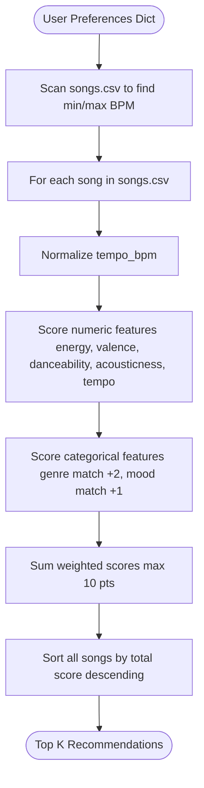

```mermaid
flowchart TD
    A([User Preferences Dict]) --> B[Scan songs.csv to find min/max BPM]
    B --> C[For each song in songs.csv]
    C --> D[Normalize tempo_bpm]
    D --> E[Score numeric features energy, valence, danceability, acousticness, tempo]
    E --> F[Score categorical features genre match +2, mood match +1]
    F --> G[Sum weighted scores max 10 pts]
    G --> I[Sort all songs by total score descending]
    I --> J([Top K Recommendations])
```
